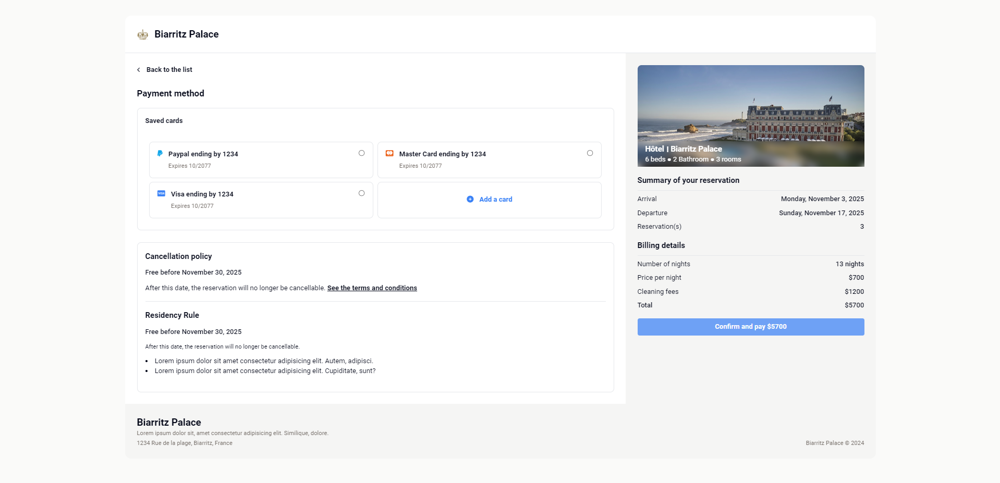

# Biarritz

Booking pay check

## Screenshots



## Tech Stack

**Client:** HTML, CSS, TailwindCSS

**Local Server:** Node

## Run Locally

Clone the project

```bash
  git clone https://github.com/Eth3ri0n/Biarritz.git
```

Go to the project directory

```bash
  cd Biarritz
```

Install dependencies

```bash
  npm install
```

Start Tailwindcss

```bash
  npm run start
```

## License

[MIT](https://choosealicense.com/licenses/mit/)
